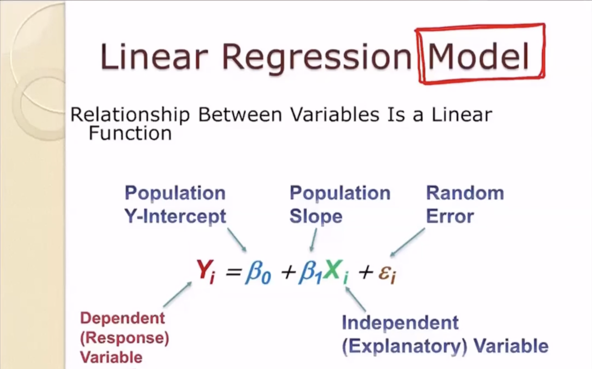

# COGS 118A Summer 2022

## Lecture 1

- Machine Learning algorithms are defined as such if performance is improved through experience (Data or Time).

#### Supervised Learning: Discriminant Models

- For tasks, humans can do themselves but we benefit from automating them.
- Learns to differentiate between n different things.
- Classifying Data

#### Unsupervised Learning: Generative Models

- For tasks humans cannot do, i.e potentially creating new insights and extracting hidden information that data contains.
- Understanding Data.

#### Optimization Algorithms:

- Gradient descent
- Genetic algorithms
- Simulated Annealing

#### Bayesian vs Frequentist

- Bayesians believe that you can't get everything from data. You have to have some ground truth.
  - This ground truth would be the prior.
  - Posterior = Data + Prior
  - Bayesian Regression
- Frequentists follow data without an initial ground truth.
  - Prior can be seen as a bias in clinical trials so a frequentist mentality would work in this situation.
  - Linear Regression is a frequentist tool

#### Bayesian Networks

- Complex Bayesian Networks have given way to deep learning
-

#### Features

- Features of something that we have to represent with numbers.
- Feature Vectors represent a bunch of features put together (features as numbers)

#### Basic Concepts

- Feature Vectors are vectors of observations
- Hidden State: Cannot be directly measured. Patterns with equal hidden state belong to the same class
- Task: To design a classifier which decides about a hidden state based on an observation

## Lecture 2

- A d-dimensional feature vector is a point in d-dimensional space

#### TFIDF

- Term frequency inverse document frequency
- How many times a word appears divided by how many documents it appears in

### KNN Algorithm

- Example:
  - If the nearest instance to the previously unseen instance is a Katydid, then the class is Katydid. Else the class is Grassshopper.
- You would take your unknown and get the euclidean distance to all the known points and find closests neighbor.
- Pros:
  - Conceptually simple and sensile.
  - Accuracy is usually good.
  - Does not assume or need points of each class to be all close together
  -
- Cons:

  - Can be slow, expensive
  - Outliers can be significant
  - It is not compact, needs large dataset to be accurate.

- Algorithm:

  1. Selecting K, what should the value be?
  2. Distance measure between two points (Euclidean distance(L2), Angular Distance, Manhattan Distance (L1))

- Normalize:

  - You want to normalize the vector
  - subtract the feature value by the mean of the feature and divide that by standard deviation

  ## Lecture 3

  Recap of KNN:

  - Pros:

    - Simple
    - No assumptions about distribution or shape of class
    - Excellent performance on wide range of tasks
    - Effective with large training set

  - Cons:

    - Time consuming
    - No insight into the domain. Doesn't tell you if classes are widely seperated, linearly seperated, etc.
    - Would prefer a compact classifier
    - No good way to determine parameter "k".
    - Depended highly on the distance measured use.
    - Have to include entire dataset as part of classifier

Next algorithms will focus on looking for boundaries

- find boundary that seperates two classes (a line or quadratic curve)
- requires minimizing or maximizing some function (objective function)
- objective functions:

#### Linear Regression:

Different ways to implement:

    - measure sum of absolute value of y_hat - y_i, drop off the max 5 % values
    - ignore all distances over 100
    - sum of square root of absolute value of y_hat - y_i, outliers will be weighed less
    - sum of (y_hat - y_i) squared, objective function in a typical linear regression

